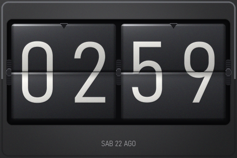
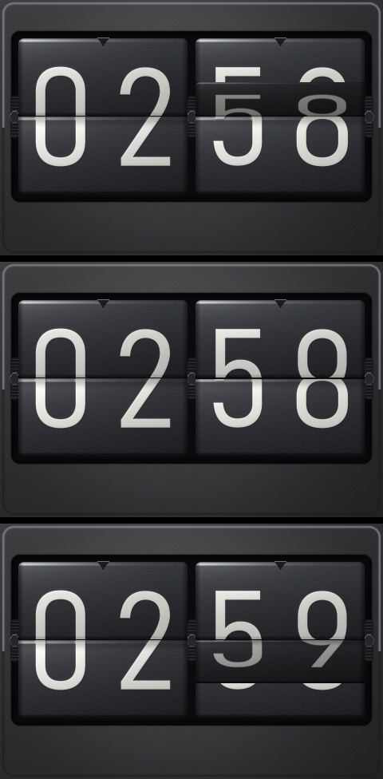

# Reloj flip fotorrealista — Elecrow 3.5" ESP32-S3 Display

Reloj de tarjetas abatibles (*flip clock*) tipo Twemco, en 480x320 apaisado, con
hora por NTP y ajuste manual táctil.



*La escena tal y como sale del generador de sprites: es exactamente lo que se
embebe en la placa, pixel por pixel.*

Hardware: **Elecrow 3.5" ESP32-S3 Display**, panel ST77922 de 320x480 con táctil
capacitivo, 16 MB de flash y PSRAM octal. Firmware sobre **LVGL 9.5.0** y
Arduino-ESP32 3.2.1 (IDF 5.4.2), compilado con **PlatformIO**.

## Cómo compilar

**1. Traer LVGL.** La copia de LVGL (99 MB de código de terceros) no está en el
repositorio; se descarga con:

```
python tools/setup_lvgl.py
```

Esto crea `vendor/lvgl9` y le coloca el `library.json` parcheado que sí está
versionado (`vendor/lvgl9-library.json`): sin él PlatformIO no compila los
fuentes de la librería.

**2. Compilar y flashear.** Ajusta `upload_port` / `monitor_port` en
`platformio.ini` a tu puerto COM y lanza:

```
pio run -t upload
pio device monitor
```

> Notas del entorno del autor (Windows, red con proxy TLS): compilar siempre
> desde **PowerShell**, nunca desde Git Bash, y con `PIP_CERT` / `SSL_CERT_FILE`
> / `REQUESTS_CA_BUNDLE` apuntando al CA bundle corporativo, o PlatformIO no
> puede descargar el toolchain.

Ocupación actual: **flash 3,28 MB de 6,55 MB** (50%), **RAM 14,4%**.

## Regenerar los sprites

Los assets embebidos (`src/assets/`) están versionados, así que no hace falta
tocar nada para compilar. Para regenerarlos hacen falta Pillow y numpy:

```
python tools/gen_assets.py --preview   # PNGs en preview/, sin tocar la placa
python tools/gen_assets.py --emit      # regenera src/assets/
```


## Cómo se consigue el aspecto

Los sprites se generan en el PC con `tools/gen_assets.py` (Pillow + numpy). No
son degradados dibujados a mano sino un pequeño **sombreador por píxel**:

- cada hoja es una superficie curvada (13° en vertical, 11° en horizontal) con
  su mapa de normales;
- iluminación Blinn-Phong con luz principal desde arriba-izquierda;
- **reflejo de entorno con Fresnel** (cielo claro arriba, suelo oscuro abajo):
  es lo que produce el canto brillante del borde superior de cada hoja, el
  detalle que más delata la falta de realismo cuando no está;
- el plástico es brillante y la serigrafía es pintura mate, con coeficientes
  distintos. Sin esa separación las cifras salen cromadas, como metal repujado;
- oclusión ambiental contra la pared del hueco, sombra proyectada de la hoja
  alta sobre la baja y micro-rugosidad que rompe el banding.

**La luz es global a la escena**: cada dígito se genera 4 veces, una por columna,
para que el reflejo cruce las cuatro cifras de forma continua en lugar de
repetirse idéntico. De ahí que haya 81 sprites y no 21.

Todos los parámetros están en los bloques `SHADE` y `STYLE` al principio del
script. `--preview` escribe PNGs en `preview/` sin tocar la placa; `--emit`
genera los assets embebidos.

### Por qué un blob y no arrays C

Los 81 sprites suman **1,88 MB**. Como arrays C en hexadecimal serían ~11 MB de
fuente y una compilación larguísima. En su lugar van a `src/assets/flip_assets.bin`,
que se embebe con `.incbin` desde `flip_assets.S`; el `.c` solo contiene los
descriptores `lv_image_dsc_t` apuntando a offsets del blob, y ocupa 20 KB.

Esto obliga a `build_src_flags = -Wa,-I$PROJECT_DIR` en `platformio.ini`, para que
el ensamblador encuentre el `.bin` por su ruta relativa.

**El blob se copia a PSRAM al arrancar** (`assets/flip_assets_psram.c`, llamado
desde `setup()` antes de crear ninguna pantalla). La flash de esta placa es quad
y la PSRAM es octal, el doble de ancho de bus, y el dibujado está limitado por
leer esos píxeles: el volteo pasa de 11,7 a 14,8 fps. Por eso los descriptores
que genera `gen_assets.py` **no son `const`**: hay que rebasar sus punteros.

El formato es `LV_COLOR_FORMAT_RGB565_SWAPPED`, el mismo que fija `lv_port.c`.
Cualquier otro obligaría a convertir en cada frame — y si algún día se ve un
tinte amarillo/magenta en pantalla, es exactamente este desajuste.

## Cómo funciona el volteo



*Tres instantes del volteo de los minutos, 02:58 → 02:59: la hoja alta
plegándose, el reposo y la hoja baja aterrizando sobre el valor nuevo. La
tarjeta de las horas no se mueve.*

En `flip_card.c`, **sin guardar un solo fotograma de animación**:

Hay **una sola variable**: el ángulo de la hoja, de 0° (levantada) a 180°
(caída). Lo que se ve es su altura aparente, que es `|cos θ|` — no una parábola
inventada — y por eso el paso por el canto sale solo, sin costura entre las dos
mitades del movimiento.

| Fase | Qué se mueve |
|---|---|
| ángulo 0 → 90° | la hoja alta vieja se pliega, pivote en su borde **inferior**. Detrás ya está la mitad alta del valor nuevo. |
| ángulo 90 → 180° | la hoja baja nueva se despliega, pivote en su borde **superior**, y aterriza sobre la mitad baja vieja. |

El ángulo avanza **casi linealmente** (`f(p) = 0,75p + 0,25p²`) y arranca ya a
25°, no en reposo. No es un capricho: con solo 6 fotogramas, imitar la gravedad
sale mal. La curva acelerada anterior dejaba las posiciones en 0°, 24°, 64°,
120° y 180° — los dos primeros indistinguibles del reposo y los dos del medio a
la misma altura, o sea **una sola posición intermedia visible**. Lo que el ojo
lee como progreso es el ángulo, así que se reparte por igual:

```
25°  51°  82°  |  109°  142°  180°
91%  63%  14%  |   33%   79%  100%
── mitad alta ──   ── mitad baja ──
```

Duración **480 ms**. Más lento que un flip mecánico real (~200 ms), pero con un
coste fijo de ~80 ms por fotograma la duración no elige la velocidad: elige
cuántas posiciones caben. 260 ms daban 4; 480 ms dan 6.

Las dos cifras de una tarjeta son dos imágenes independientes con la misma escala
y el mismo pivote relativo: se leen como una sola hoja porque el escalado es
puramente vertical, así que no hay costura horizontal. Esto evitó tener que
componer canvas intermedios en PSRAM.

Detalles: la hoja en movimiento se oscurece con `image_recolor_opa` de la propia
imagen (no con un objeto encima, que costaría otra capa de blending por frame);
la caída acelera y el aterrizaje lleva un rebote corto al final; y
**la ranura del eje está horneada en la última fila del sprite de la mitad alta**,
para que viaje con la hoja en vez de quedarse fija en la escena.

## Uso

- **Pulsación larga** sobre la carcasa → ajustes, en tres pestañas:
  - **HORA** — rollers de hora, minuto y fecha.
  - **WIFI** — SSID y contraseña, en NVS con namespace `flipclk` (namespace propio para no
    colisionar con otros sketches del mismo dispositivo).
  - **PANTALLA** — brillo (0-100 %) y giro de 180°.
- Un punto verde tenue abajo a la derecha indica WiFi conectado.
- Formato **24 horas**.
- Zona horaria: **America/Santiago** (Chile continental), cadena POSIX
  `<-04>4<-03>,M9.1.6/24,M4.1.6/24` en `time_src.cpp` — UTC-4 en invierno y
  UTC-3 en verano, con cambio el primer sábado de septiembre y el primer sábado
  de abril a las 24:00. Verificado contra tzdata 2026.3.
  La Región de Magallanes no cambia de hora: allí sería `<-03>3`.
- Sin red, el reloj funciona con el RTC interno y reintenta NTP cada 15 min. La
  UI nunca se bloquea esperando a la red.

### Brillo y giro

Ambos se guardan en NVS (`prefs.cpp`) y se aplican al arrancar.

Nota: la pantalla se repinta entera cada 10 s (`clock_ui.c`). El driver del
fabricante no limpia la memoria gráfica del panel al inicializar, y en modo FULL
LVGL solo refresca cuando algo se invalida — el reloj apenas invalida nada entre
minuto y minuto, así que una zona que no cambia puede conservar basura
indefinidamente.

El **giro de 180°** es en caliente, sin reiniciar: alterna la rotación software
del flush entre 90° y 270°, que son las dos orientaciones apaisadas, así que no
cambian ni la resolución ni los buffers. `bsp_display_set_flipped()` gira **a la
vez la imagen y el táctil** — si solo girase la imagen, tocar arriba respondería
abajo y los ajustes quedarían inservibles justo después de activar la opción.

El **brillo** lleva **corrección gamma** (`bsp_display_brightness_set`). El duty
del PWM es proporcional a la luz emitida, pero el ojo no responde de forma
lineal: un 10 % de luz se percibe como un ~35 % de brillo, así que con el mapeo
lineal original bajar el deslizador al 10 % apenas oscurecía la pantalla. Ahora
el porcentaje se eleva a 2,2 (el exponente estándar de percepción), de modo que
el deslizador es aproximadamente lineal en brillo *percibido* y la mitad
inferior sirve de verdad para uso nocturno:

| deslizador | 100 % | 50 % | 20 % | 10 % | 5 % | 2 % |
|---|---|---|---|---|---|---|
| duty (de 8191) | 8191 | 1777 | 237 | 52 | 11 | 2 |

Para eso el PWM pasó de **10 bits a 13** (con 10 bits, un 5 % percibido caía en
1-2 pasos de duty: no había resolución donde más falta) y de 5 kHz a **2 kHz**,
para que a duty muy pequeño el pulso siga siendo lo bastante largo como para que
el driver del LED lo reproduzca. Sigue muy por encima del parpadeo visible.

El brillo llega hasta 0 %, que apaga el backlight del todo. Para que eso no
sea una trampa sin salida, dentro de la pantalla de ajustes el brillo nunca baja
de `PREFS_BRIGHTNESS_UI_MIN` (10 %) — si no, no se vería el propio deslizador —
y el valor real se aplica al salir. Para recuperarse de un 0 %: pulsación larga
sobre la pantalla apagada, que sube el brillo al mínimo de UI al abrir ajustes.

### Comandos por Serial (115200)

- `f` — fuerza un volteo, para no esperar al minuto durante el desarrollo.
- `t` — imprime hora, si es válida y si hay WiFi.

## Estado — verificado en pantalla

- [x] Assets generados y aprobados
- [x] Reloj funcionando: imagen correcta, volteo aceptable
- [x] NTP contra router real, hora de Santiago correcta
- [x] Giro de 180° en caliente (imagen + táctil)
- [x] Brillo con gamma: al 3 % sirve como reloj de noche, sin parpadeo

### Rendimiento: lo que se intentó y por qué quedó así

El volteo va a **6 fotogramas en ~530 ms**. El límite es el coste por fotograma
(~80 ms), no la animación.

Lo que sí funcionó: **copiar los sprites a PSRAM** (11,7 → 14,8 fps) y
**repartir el ángulo por igual** en vez de imitar la gravedad. Lo que no movió
la aguja, medido: quitar el antialiasing del escalado y quitar la sombra
proyectada.

Se intentó `LV_DISPLAY_RENDER_MODE_PARTIAL` para repintar solo la tarjeta en
vez de los 480x320 enteros, y **hubo que descartarlo**: el flush de este port
solo produce imagen correcta cuando el área es la pantalla completa. Con
cualquier área menor —incluso ocupando el ancho completo— el contenido sale
desplazado fila a fila y la pantalla se llena de ruido diagonal.

Lo que sí quedó comprobado durante ese intento, por si alguien retoma el tema:

- **El fallo no está en el envío al panel.** Rellenando el bloque ya rotado con
  un color fijo, sale limpio y en su sitio: la ventana se abre bien y el DMA
  transfiere bien. El problema es cómo el flush interpreta el buffer de LVGL.
- **El stride no es el ancho del área** (se midió: 212 px para un área de 106).
  Corregirlo con `lv_display_get_buf_active()` no bastó.
- **El port daba por terminado el envío antes de que el DMA acabara**: hacía un
  `give` del semáforo y N `take`, y lanzaba el último `draw_bitmap` sin
  esperarlo. Con pantalla completa colaba porque el fotograma siguiente tardaba
  más que la transferencia. **Esto sí está corregido** (el semáforo ahora
  significa "DMA libre" y se espera la última transferencia).
- **El panel no soporta rotación por hardware** (`swap_xy is not supported by
  this panel`), así que la rotación software no es evitable.

Vías no exploradas si se quiere más velocidad: medir por separado dibujado,
rotación y envío para saber cuál domina; o reescribir el flush entero en vez de
parchear el del fabricante.

## Licencia

MIT — ver [LICENSE](LICENSE).

Los ficheros del BSP del fabricante (`esp_bsp.*`, `lv_port.*`, `esp_lcd_st77922.*`,
`esp_lcd_touch.*`) proceden de los ejemplos de Elecrow/Espressif y conservan sus
respectivos avisos de copyright. LVGL es MIT y no se distribuye aquí: lo descarga
`tools/setup_lvgl.py`.
